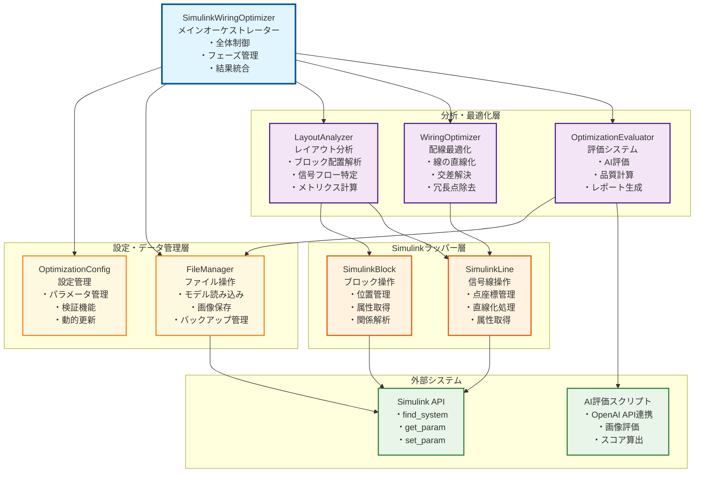

# Simulink配線自動整理ツール 設計書

## 概要

このツールは、人間が行う配線整理の手順を真似して、Simulinkモデルの配線を自動的にきれいに整理するシステムです。段階的で理解しやすい整理プロセスを提供します。

## 設計思想

### 1. 人間の最適化プロセスの模倣
```
人間の思考プロセス:
1. 全体俯瞰 → レイアウト把握
2. 信号フロー理解 → データ流れの特定
3. 問題箇所特定 → 複雑配線・交差の発見
4. 段階的改善 → サブシステムごとの最適化
```

### 2. 段階的処理アプローチ
```
Phase 1: 前処理 → モデル読み込み・バックアップ
Phase 2: 分析 → レイアウト・信号フロー解析
Phase 3: 最適化 → 配線の直線化・交差解決
Phase 4: 評価 → AI評価・メトリクス計算
Phase 5: 後処理 → 結果保存・レポート生成
```

## システム構成図



## 各コンポーネントの処理概要

### 1. SimulinkWiringOptimizer（メイン制御部）

**役割**: 全体の処理フローを制御し、各コンポーネントを協調させる

**主要機能**:
- `optimize(modelName)`: メイン配線整理処理
- `optimizeSubsystem(modelName, subsystemName)`: 特定部分の配線整理
- `updateConfig(options)`: 設定の変更
- `getMetrics()`: 整理品質の測定
- `displayResults()`: 結果表示

**処理の流れ**:
```
1. 準備 → バックアップ・読み込み・初期画像保存
2. 分析 → レイアウト解析・信号の流れ特定
3. 整理 → 配線改善・交差解決
4. 評価 → AI評価・品質測定
5. 完了 → 結果保存・レポート生成
```

### 2. OptimizationConfig（設定管理）

**役割**: 全システムの設定パラメータを一元管理

**主要機能**:
- パラメータ検証と型チェック
- 設定の動的更新
- デフォルト値の管理

**設定項目**:
```matlab
preserveLines: true           % 既存線保持
enableAIEvaluation: true      % AI評価機能の有効化
targetSubsystem: ''           % 対象サブシステム
verbose: true                 % 詳細出力
wiringParams: struct(         % 配線パラメータ
    'baseOffset', 10,
    'minSpacing', 15,
    'tolerance', 1e-6
)
```

### 3. FileManager（ファイル操作）

**役割**: モデルファイルと画像の読み書き、バックアップ管理

**主要メソッド**:
- `createBackup(modelName)`: バックアップ作成
- `loadModel(modelName)`: モデル読み込み
- `saveModelImage(systemName, path)`: 画像保存
- `saveOptimizedModel(modelName)`: 最適化モデル保存

**処理特徴**:
- 自動バックアップ機能
- 高解像度画像出力
- エラー時の代替処理

### 4. LayoutAnalyzer（レイアウト分析）

**役割**: モデル構造の分析と信号フローの特定

**主要メソッド**:
- `analyzeLayout(systemName)`: 包括的レイアウト分析
- `analyzeBlocks(systemName)`: ブロック情報収集
- `analyzeLines(systemName)`: 信号線情報収集
- `analyzeSignalFlow(blocks, lines)`: 信号フロー解析

**分析内容**:
```
ブロック分析:
- 位置・サイズ・タイプ
- サブシステム判定
- 接続関係

信号線分析:
- 点座標・長さ・セグメント数
- 水平/垂直判定
- 複雑度評価

信号フロー分析:
- 主要方向推定（left_to_right等）
- レイヤー構造特定
- 接続グラフ構築
```

**キャッシュ機能**: 分析結果を保存して高速化

### 5. WiringOptimizer（配線最適化）

**役割**: 実際の配線改善処理を実行

**主要メソッド**:
- `optimizeAllSubsystems(modelName)`: 全サブシステム最適化
- `optimizeSubsystemWiring(subsystemName)`: 個別サブシステム最適化
- `optimizeSingleLine(line)`: 単一線最適化

**最適化手法**:
```
線の直線化:
- 水平/垂直線への変換
- 最短経路の計算
- 冗長点の除去

交差の解決:
- 交差検出アルゴリズム
- オフセットによる回避
- 優先度に基づく調整

品質向上:
- セグメント数の最小化
- 線長の最適化
- 視覚的美しさの向上
```

### 6. OptimizationEvaluator（評価システム）

**役割**: 最適化結果の定量的・定性的評価

**主要メソッド**:
- `evaluateWithAI(beforeImage, afterImage)`: AI評価実行
- `calculateMetrics(systemName)`: メトリクス計算
- `generateReport(metrics, aiResult)`: レポート生成

**評価項目**:
```
定量メトリクス:
- 直線率: 水平/垂直線の割合
- 平均セグメント数: 線の複雑度
- レイアウト密度: 空間効率

AI評価:
- OpenAI GPT-4oによる画像評価
- 0-100点のスコアリング
- 改善提案の生成
```

### 7. SimulinkLine（信号線ラッパー）

**役割**: Simulink信号線操作の抽象化

**主要メソッド**:
- `straighten(method)`: 線の直線化
- `removeRedundantPoints()`: 冗長点除去
- `getLength()`: 線長計算

**機能**:
- 点座標の安全な操作
- 線種別の自動判定
- エラーハンドリング

### 8. SimulinkBlock（ブロックラッパー）

**役割**: Simulinkブロック操作の抽象化

**主要メソッド**:
- `getBlockInfo()`: ブロック情報取得
- `isSubsystem()`: サブシステム判定
- `isLinkLibrary()`: リンクライブラリ判定

**機能**:
- 位置・サイズ情報の取得
- ブロック属性の解析
- 安全な属性アクセス

## 使用方法

### 基本的な使い方

#### 方法1: 直接実行（簡単）
```matlab
% モデル名を指定して自動実行
optimizer = SimulinkWiringOptimizer('fullCarModel.slx');
% → 自動的に配線整理が実行され、結果が表示されます
```

#### 方法2: 段階的実行（詳細制御）
```matlab
% 1. 配線整理ツールの作成
optimizer = SimulinkWiringOptimizer();

% 2. 配線整理の実行
result = optimizer.optimize('fullCarModel.slx');

% 3. 結果の確認
optimizer.displayResults();
```

**どちらの方法でも使用できます**:
- ✅ 簡単: `SimulinkWiringOptimizer('model.slx')`
- ✅ 詳細: `optimizer.optimize('model.slx')`

### 詳細設定

#### 設定付きで直接実行
```matlab
% モデル名 + 詳細設定で自動実行
optimizer = SimulinkWiringOptimizer('fullCarModel.slx', ...
    'preserveLines', false, ...
    'enableAIEvaluation', true, ...
    'wiringParams', struct('baseOffset', 15));
```

#### 設定のみ指定
```matlab
% 詳細設定でツール作成
optimizer = SimulinkWiringOptimizer(...
    'preserveLines', false, ...
    'enableAIEvaluation', true, ...
    'wiringParams', struct('baseOffset', 15));

% 後で実行
result = optimizer.optimize('fullCarModel.slx');
```

### 部分的な配線整理
```matlab
% 特定の部分のみ整理
result = optimizer.optimizeSubsystem('model.slx', 'model/Engine');
```

## 設計の利点

### 1. 保守性
- 単一責任原則による明確な役割分離
- 依存性注入による疎結合
- 包括的なエラーハンドリング

### 2. 拡張性
- プラグイン可能なアーキテクチャ
- 新しい最適化アルゴリズムの追加が容易
- 設定パラメータの動的追加

### 3. テスタビリティ
- 各コンポーネントの独立テスト
- モックオブジェクトの使用可能
- 段階的なテスト実行

### 4. 理解しやすさ
- 段階的処理による直感的なフロー
- 人間の思考プロセスとの対応
- 明確な責任分離

## 今後の発展

1. **機械学習統合**: パターン学習による自動整理
2. **並列処理**: 大規模モデルの高速化
3. **GUI開発**: ビジュアルな操作画面
4. **他ツール連携**: CADツールとの統合

このシステムは、モジュラー設計の原則に従いながら、人間の直感的な理解を重視した構造を実現しています。
